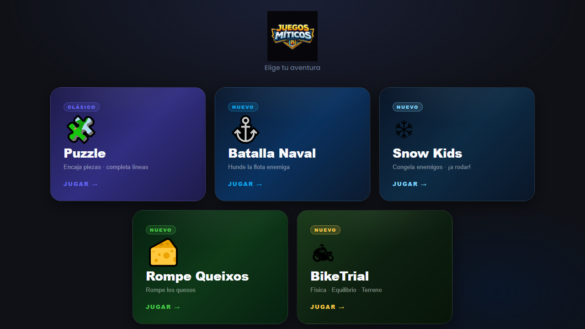
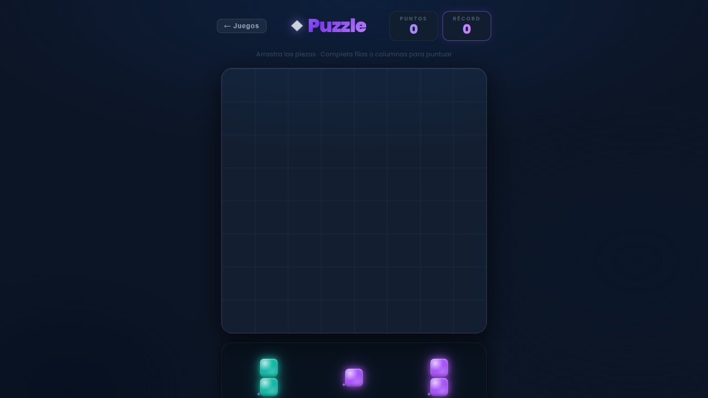
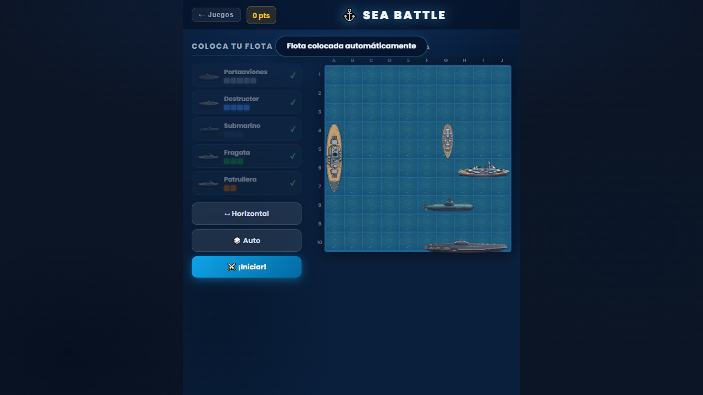
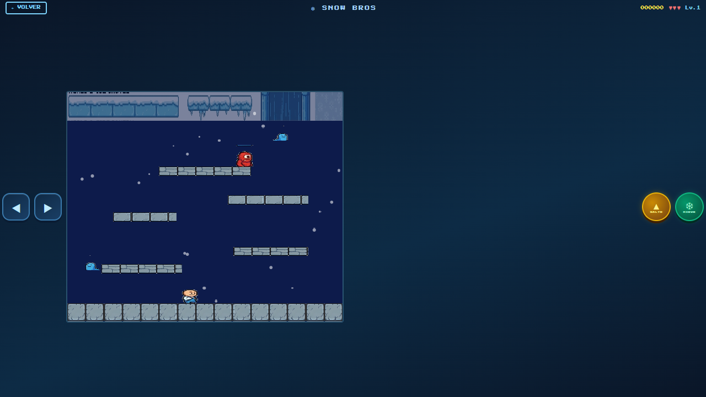
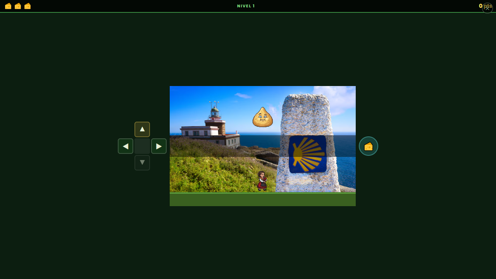

# moreGames

> Colección de minijuegos arcade construidos con **React 19 + Vite** y sonido 100 % sintetizado — sin archivos de audio, sin dependencias pesadas.



---

## Juegos disponibles

### Puzzle
> *Encaja piezas · Completa líneas*

Clon de Block Puzzle: arrastra 3 piezas a un tablero 9×9 y completa filas o columnas para limpiarlas. Combo BOOM al limpiar varias a la vez, récord persistente en `localStorage` y música electrónica en Do mayor.



| Mecánica | Detalle |
|---|---|
| Controles | Drag & drop (ratón y touch) |
| Puntuación | Bloques colocados + bonus por líneas |
| Especial | Explosión de partículas al limpiar líneas múltiples |

---

### Batalla Naval — *Sea Battle*
> *Hunde la flota enemiga*

Hundir la flota contra una IA con lógica de targeting inteligente (hunt/destroy mode). Fase de colocación manual o aleatoria, animaciones de misiles en vuelo, sprites de barcos con barras de salud. Música de marcha naval en Mi menor.



| Mecánica | Detalle |
|---|---|
| Barcos | 5 tipos: portaviones, buque, submarino, fragata, patrulla |
| IA | Modo caza + modo destrucción |
| Puntuación | +100 por impacto · +500 por hundimiento |
| Especial | Misil animado en tiempo real entre los dos tableros |

---

### Snow Kids
> *Congela enemigos · ¡A rodar!*

Clon de Snow Bros. Plataformas en Canvas 2D: el jugador congela enemigos con nieve y los lanza como bolas rodantes contra otros. Múltiples niveles, nivel boss con Super Jefe, HUD de vidas y D-pad táctil para móvil.



| Mecánica | Detalle |
|---|---|
| Controles | Teclado + botones virtuales mobile |
| Movimiento | Izq / Der + salto + disparo de nieve |
| Especial | Boss level con Super Jefe al completar niveles |
| Orientación | Landscape y portrait con D-pad adaptativo |

---

### Rompe Queixos — *O Viaxe das Tetillas*
> *Pang galego · Estilo Arcade*

Clon de Pang ambientado en Galicia. Dispara mexillóns para romper tetillas que rebotan por la pantalla. Cada impacto las divide en dos hasta destruirlas. 5 niveles con melodías folk/gaita únicas.



| Mecánica | Detalle |
|---|---|
| Idioma | Gallego |
| Controles | `A/D` o `←/→` mover · `Space/J` disparar |
| Vidas | 3 vidas (icono 🧀) |
| Música | 5 melodías pentatónicas en Sol mayor, 108–168 BPM |

---

## Arquitectura

```
moreGames/
├── moregames/               ← Proyecto Vite/React
│   ├── src/
│   │   ├── App.jsx          ← Dashboard con selector de juegos
│   │   ├── dashboard.css
│   │   ├── utils/
│   │   │   └── synthSounds.js   ← Motor de audio Web Audio API
│   │   └── games/
│   │       ├── Puzzle/
│   │       │   ├── PuzzleGame.jsx
│   │       │   ├── components/  ← Board, Piece, DragGhost, ComboToast
│   │       │   └── logic/       ← boardUtils, pieceUtils, scoreSystem
│   │       ├── Battleship/
│   │       │   ├── BattleshipGame.jsx
│   │       │   └── logic/       ← battleshipLogic (IA, flota, disparos)
│   │       ├── SnowBros/
│   │       │   ├── GameCanvas.jsx
│   │       │   ├── HUD.jsx
│   │       │   └── logic/       ← playerLogic, enemyLogic, collisionLogic
│   │       └── ViaxeDasTetillas/
│   │           ├── TetillasCanvas.jsx
│   │           └── logic/       ← player, tetillas, collisions, gameLoop
│   ├── public/
│   └── package.json
└── README.md
```

---

## Audio — 100 % sintetizado

Todos los efectos de sonido y la música se generan en tiempo real con **Web Audio API**. Cero archivos `.mp3` o `.ogg`.

| Juego | Estilo musical | SFX destacados |
|---|---|---|
| Puzzle | Do mayor · 155 BPM · onda cuadrada | Colocar pieza, línea, boom, game over |
| Batalla Naval | Mi menor · 102 BPM · diente de sierra | Misil, impacto, hundimiento, victoria |
| Snow Kids | Scheduler look-ahead por nivel | Congelación, rodar, boss |
| Rompe Queixos | 5 melodías folk 108–168 BPM | Disparo, pop, destruir, salto |

El scheduler usa **look-ahead de 0.3 s** con `setInterval` de 80 ms para evitar glitches incluso en pestañas en segundo plano.

---

## Controles móviles

Snow Kids y Rompe Queixos incluyen **botones táctiles virtuales** con `onPointerDown / Up / Leave / Cancel` para comportamiento correcto en móvil:

- **Portrait** — D-pad inferior + botones de acción
- **Landscape** — D-pad izquierdo + botones de acción a la derecha del canvas

---

## Instalación y desarrollo

```bash
cd moregames
npm install
npm run dev       # http://localhost:5173
npm run build     # dist/ optimizado
npm run preview   # preview del build
```

**Requisitos**: Node.js >= 18, navegador moderno con soporte de Web Audio API y Canvas 2D.

---

## Stack tecnológico

| Tecnología | Versión | Uso |
|---|---|---|
| React | 19 | UI y gestión de estado |
| Vite | 6 | Bundler y dev server |
| Web Audio API | nativa | Síntesis de audio completa |
| Canvas 2D API | nativa | Render de juegos de plataformas |
| @dnd-kit/core | 6 | Drag & drop del Puzzle |

---

*More Games · 2026*
